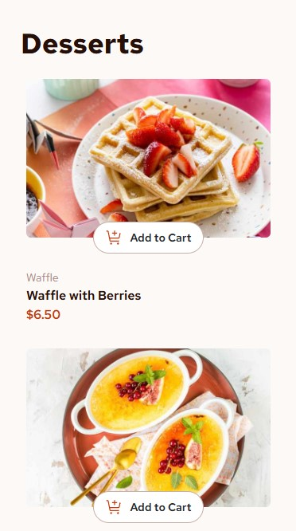
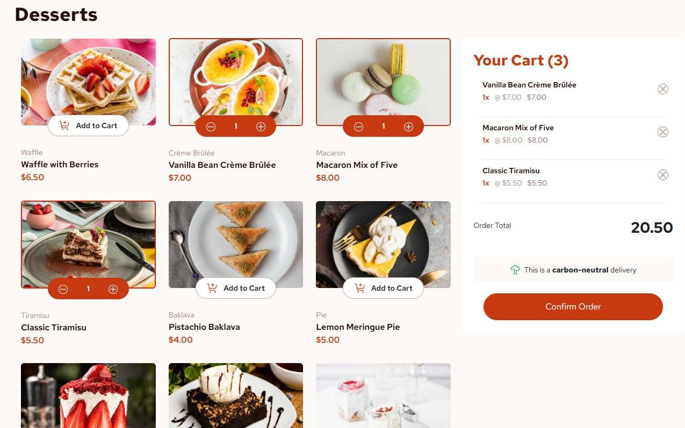

# Frontend Mentor - Product list with cart solution

This is a solution to the [Product list with cart challenge on Frontend Mentor](https://www.frontendmentor.io/challenges/product-list-with-cart-5MmqLVAp_d).

## Table of contents

- [Overview](#overview)
  - [The challenge](#the-challenge)
  - [Screenshot](#screenshot)
- [My process](#my-process)
  - [Built with](#built-with)
  - [What I learned](#what-i-learned)
  - [Continued development](#continued-development)
- [Author](#author)

## Overview

### The challenge

Users should be able to:

- Add items to the cart and remove them
- Increase/decrease the number of items in the cart
- See an order confirmation modal when they click "Confirm Order"
- Reset their selections when they click "Start New Order"
- View the optimal layout for the interface depending on their device's screen size
- See hover and focus states for all interactive elements on the page

### Screenshots

**Mobile UI**

**Desktop UI**

### Links

- Live Site URL: [Add live site URL here](https://your-live-site-url.com)

## My process

This challenge from Frontend Mentor allowed me to practice my skills with DOM manipulation and building out a user-focused and modern UI. This project really forced me to think more intently about control flow and the hierarchy of my functions due to this project's functionality being implemented solely by Vanilla Javascript. I began my process by creating a rough layout of where things should be relative to the UI designs provided. I thought about the styling that would be needed and how each piece of the UI could be split up into semantic HTML for SEO purposes. I then built and styled the mobile-version of the UI first, and built out the interactivity.

### Built with

- Semantic HTML5 markup
- CSS custom properties
- Flexbox
- CSS Grid
- Mobile-first workflow
- [Bootstrap](https://getbootstrap.com/) - Frontend Toolkit
- [SASS](https://sass-lang.com/) - CSS Preprocessor

### What I learned

I learned a great deal about Bootstrap classing and using it to build responsive UI. This library significantly enhanced my workflow and shortened the time to build out each part of the UI in a way that made sense. I also implemented SASS extendables for the first time, which loosened coupling between a good amount of my CSS design.

### Continued development

- [ ] Abstract Javascript further for better conciseness
- [ ] Implement a branch using React.js
- [ ] Build out a tablet version of the UI

## Author

- Github - [@AD-May](https://github.com/AD-May)
- LinkedIn - (https://www.linkedin.com/in/alexander-may-6148a3242/)
